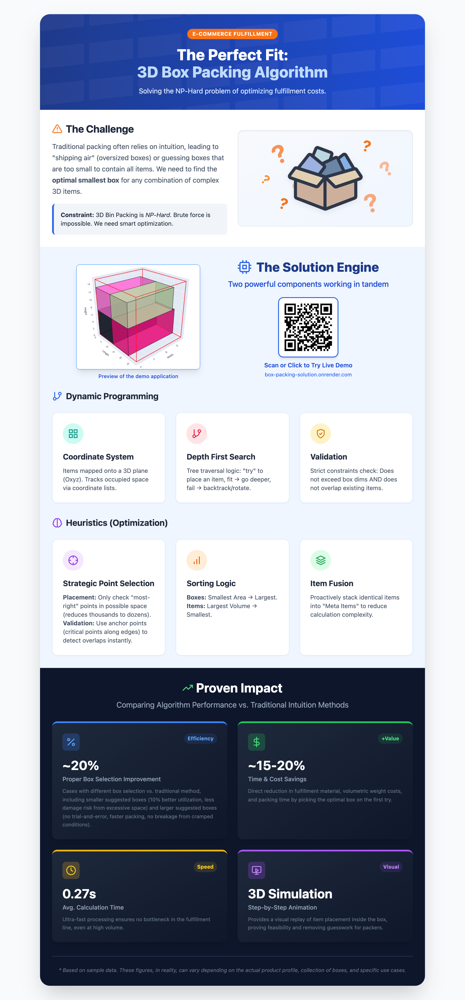

# 📦 3D Box Packing Algorithm

> An intelligent fulfillment optimization system that combines **Dynamic Programming** with **Heuristic Strategies** to solve real-world 3D bin packing challenges.

## 🚀 Live Demo

**Try it yourself:** [https://box-packing-solution.onrender.com/](https://box-packing-solution.onrender.com/)

Experience the algorithm in action with an interactive 3D visualization showing step-by-step item placement.

---

## 🎯 Overview

This project addresses a critical challenge in e-commerce fulfillment: **determining the optimal box size and item arrangement** to minimize shipping costs, reduce packaging waste, and improve operational efficiency.

### The Problem
- 📊 Thousands of daily orders with varying item combinations
- 💰 Shipping costs directly tied to box dimensions and weight
- ⚠️ Manual box selection leads to oversized packages and wasted space
- ⏱️ Time-consuming trial-and-error packing processes

### The Solution
An automated 3D box packing algorithm that:
- ✅ Selects the most appropriate box size from available inventory
- ✅ Generates optimal 3D placement coordinates for all items
- ✅ Validates physical constraints (dimensions, weight, fragility)
- ✅ Provides visual 3D simulation for verification

---

## 🔑 Key Features

### 🎯 Intelligent Box Selection
Evaluates all available box options against the item set and recommends the most cost-effective choice that accommodates all items safely.

### 🧮 Hybrid Algorithm Architecture

#### **Dynamic Programming Core**
- **Optimal Substructure**: Breaks down complex packing problems into manageable sub-problems
- **Memoization**: Caches solutions to avoid redundant calculations
- **Strategic Point Selection**: Uses a dual-strategy approach:
  - **Corner Priority**: Tests corner points first for natural stability
  - **Surface Mapping**: Identifies potential placement points along existing item surfaces for tighter packing

#### **Heuristic Enhancements**
- **Priority-Based Placement**: Items are sorted by size, fragility, and stackability before placement
- **Multi-Orientation Testing**: Each item is tested in all valid rotations (respecting constraints)
- **Greedy Best-Fit**: Selects placement positions that minimize wasted space and maintain stability

---

## 📊 Proven Impact

| Metric | Result | Description |
|--------|--------|-------------|
| **Proper Box Selection** | ~20% Improvement | Significant reduction in oversized box usage |
| **Cost & Time Savings** | ~15-20% Reduction | Lower fulfillment costs and faster processing |
| **Processing Speed** | 0.27s Average | Real-time calculation suitable for high-volume operations |
| **Visual Verification** | 3D Simulation | Interactive step-by-step placement animation |

_* Based on sample data. Actual results may vary depending on product profile, box inventory, and specific use cases._

---

## 🛠️ How It Works

### The Challenge
Traditional approaches struggle with:
- **Brute Force Complexity**: Testing all permutations is computationally infeasible (factorial time complexity)
- **Greedy Limitations**: Simple greedy algorithms get stuck in local optima

### The Solution Engine
1. **Input Processing**: Receive order items (dimensions, weight, fragility) and available box inventory
2. **Box Evaluation**: Dynamic Programming evaluates feasibility for each box option
3. **Optimal Placement**: Heuristic strategies determine precise 3D coordinates
4. **Validation**: Checks all physical constraints (overlap, stability, weight distribution)
5. **Output**: Returns recommended box + 3D placement instructions + visual simulation

---

## 💼 Business Value

- **Cost Reduction**: Minimize shipping expenses through optimal box selection
- **Operational Efficiency**: Eliminate guesswork and reduce packing time
- **Sustainability**: Reduce packaging waste and environmental impact
- **Scalability**: Handle high-order volumes with sub-second processing
- **Quality Assurance**: Visual verification prevents packing errors

---

## 🧰 Technology Stack

- **Backend**: Python (algorithm implementation)
- **Visualization**: Three.js / WebGL (3D rendering)
- **Web Framework**: Flask / Dash (API and interface)
- **Deployment**: Render (cloud hosting)

---

## 📸 Screenshots

*Algorithm overview and proven impact metrics*

---

## 📚 Technical Background

This project demonstrates the practical application of:
- **Dynamic Programming**: Breaking down complex optimization problems
- **Heuristic Algorithms**: Balancing optimality with computational efficiency
- **3D Computational Geometry**: Spatial reasoning and collision detection
- **Algorithm Design**: Combining theoretical concepts with real-world constraints

---

## 📄 License

This is a showcase project demonstrating algorithmic capabilities. The core algorithm implementation is proprietary and not included in this repository.

**What's Included**:
- ✅ Project overview and documentation
- ✅ Live demo interface
- ✅ Visual infographic
- ✅ Technical concept explanation

**What's Not Included**:
- ❌ Proprietary algorithm source code
- ❌ Internal business logic
- ❌ Production deployment configuration

---

- This readme is created by AI lol =]]]